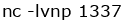
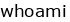
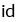
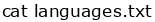
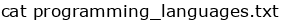
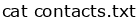

<!--
Want to recreate my idea? Since Github's markdown doesn't allow colored text i used this website to recreate terminal commands as png images:
https://text2image.com/en/
Settings:
- Font: Verdana;
- Font-size: 10pt;
- Image-height: 22;
- Image-width: depends on the width of the command.
- Background color: transparent;
- Forecolor: black for commands, blue for the $PS1 variable;
- v-align: center;
- Format: PNG.
-->
>  \
>listening on [any] 1337 \
>Connection received on https://github.com/quietmeteor/ \
>  \
Andrii Dumitrashchuk \
  \
uid=1001(Andrii Dumitrashchuk) &nbsp; gid=1002(students) &nbsp; groups=1003(programming),1004(pentesting),1005(ctf) \
  \
languages.txt &nbsp; programming_languages.txt &nbsp; contacts.txt \
  \
I fluently speak and write in the following languages:
>- Russian
>- Ukranian
>- English
>- Italian  
>
>  \
I'm able to code in:
>- Java, JavaFX, also developing applications for Android;
>- Python, i use it more for scripting;
>- Code web-applications (html, css, js, ts, angular);
>- C/C++ (I'm helping, and thus learning myself, my UNI friend with that language since he never coded before).
>
>Willing to learn Ruby and maybe Rust next.
>
>  \
> Want to contact me or just send a scam link?
>- Discord: qmeteor#3228
>- mailto:andrealemore@gmail.com
>- LinkedIn: coming soon.
>
> I do not possess other socials.
